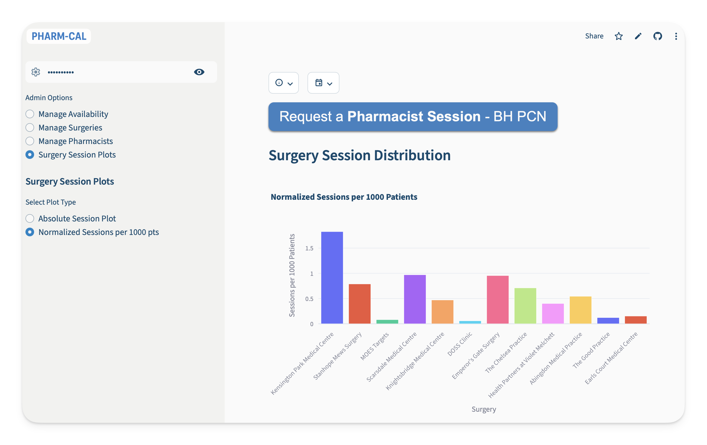

# Streamlit Pharmacist Booking Calendar

This is a Streamlit web application that provides a simple and interactive calendar system for booking pharmacist sessions. The application uses Supabase as a backend to store and manage availability, bookings, surgeries, pharmacists, and future cover requests.



## Features

- **Interactive Calendar View**: Displays available pharmacist sessions for the next two months.
- **Booking System**: Users can click on an available slot to book a session.
- **Dynamic Booking Form**: A dialog appears to enter booking details, including selecting an existing surgery or adding a new one.
- **Admin Panel**: A password-protected admin section to manage the application's data.
- **Availability Management**: Admins can update pharmacist availability for AM/PM shifts.
- **Surgery Management**: Admins can add and delete surgery locations and their contact emails.
- **Pharmacist Management**: Admins can add and delete pharmacists from the system.
- **Supabase Backend**: All operational data is stored in Supabase with UUID-based relationships between sessions, surgeries, pharmacists, and requests.

## How to Run

1.  **Clone the repository:**
    ```bash
    git clone <repository-url>
    cd streamlit-cal
    ```

2.  **Install dependencies:**
    Make sure you have Python installed. Then, install the required packages using the `requirements.txt` file.
    ```bash
    pip install -r requirements.txt
    ```

3.  **Set up Supabase credentials:**
    - Create a `.streamlit` directory if it doesn't exist.
    - Create a `secrets.toml` file inside the `.streamlit` directory.
    - Add your Supabase and app credentials to the `secrets.toml` file in the following format:
      ```toml
      # .streamlit/secrets.toml
      SUPABASE_URL = "https://your-project-id.supabase.co"
      SUPABASE_SERVICE_ROLE_KEY = "your-service-role-key"
      RESEND_API_KEY = "re_xxxxxxxxxxxx"
      admin_password = "your_secure_password_here"
      ```

4.  **Set up the Supabase schema:**
    - Run the SQL files in the `supabase_sql/` directory in order.
    - If your database already uses the older combined surgery-contact `users` table, also run `004_split_surgeries_and_users.sql` to split it into `surgeries` and `users`.
    - Import your legacy CSVs through staging tables as described in the migration notes.
    - Verify that `public.relationship_backfill_audit` returns no unresolved rows before using the app.

5.  **Run the Streamlit app:**
    ```bash
    streamlit run app.py
    ```

## Admin Access

To access the admin panel, use the password.

## Dependencies

- `streamlit`
- `pandas`
- `supabase`
